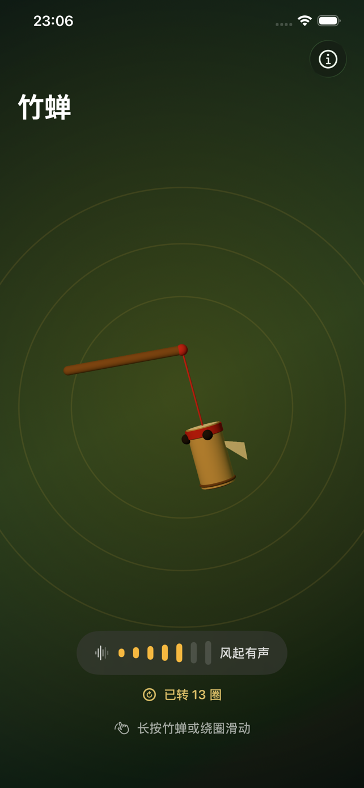
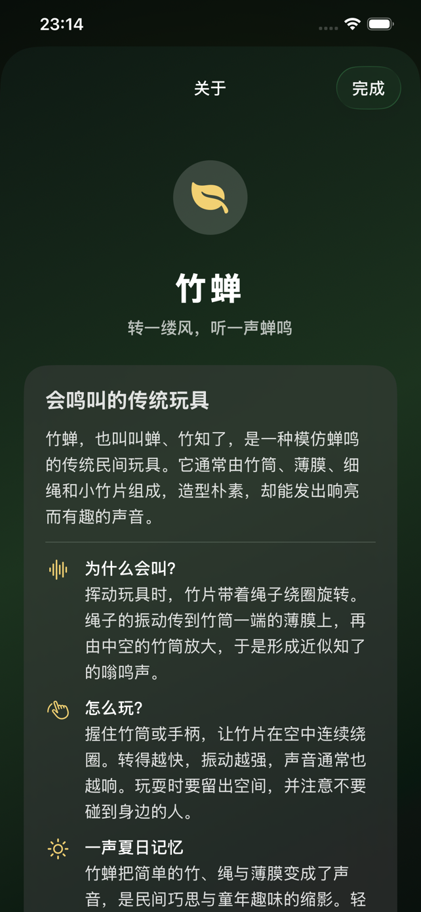

# BambooCicada · 竹蝉

一款将中国传统民间玩具「竹蝉」带到 iPhone 与 Apple TV 上的互动应用。

An interactive iPhone and Apple TV app inspired by the traditional Chinese bamboo cicada toy.

[中文](#中文) · [English](#english)

## 应用截图 · Screenshots

<p align="center">
  
  
  
</p>

---

## 中文

### 项目简介

BambooCicada 使用 SwiftUI 与 SceneKit 模拟竹蝉的旋转、绳索摆动和翅膀振动。长按或绕圈滑动即可让竹蝉旋转；转速、绳索张力与运动状态会共同影响实时合成的蝉鸣。

所有画面、物理效果和声音均在设备端生成，无需网络连接，也不依赖第三方库或外部音频素材。

### 灵感来源

本项目的灵感来自 [imsai-sh/zhuzhiliao](https://github.com/imsai-sh/zhuzhiliao)，感谢原项目对「竹知了」数字化体验的探索与分享。

### 功能特色

- 基于 SceneKit 的程序化 3D 竹蝉模型
- 包含重力、空气阻力、绳索张紧与松弛状态的物理模拟
- 使用 AVFoundation 实时合成、随转速变化的蝉鸣
- 支持长按和绕圈滑动两种操作方式
- 支持 Apple TV 遥控器触控盘与方向键
- 实时声音强度指示与累计旋转圈数
- 使用 `AppStorage` 在本地保留累计圈数
- 深色沉浸式界面，并提供基础辅助功能描述

### 系统要求

- Xcode 15 或更高版本
- iOS 17.0 或更高版本
- tvOS 17.0 或更高版本
- Swift 5

### 开始使用

1. 克隆仓库：

   ```bash
   git clone https://github.com/krayc425/BambooCicada.git
   cd BambooCicada
   ```

2. 使用 Xcode 打开 `BambooCicada.xcodeproj`。
3. 选择 `BambooCicada` Scheme 以及 iPhone 或 Apple TV 模拟器/设备。
4. 按下 `⌘R` 构建并运行。

项目没有第三方依赖，因此无需执行额外的包安装步骤。在真机上运行时，请在 Xcode 的 Signing & Capabilities 中选择你自己的开发团队。

### 操作方式

#### iPhone

- 长按竹蝉：以稳定速度持续旋转。
- 围绕竹蝉画圈滑动：根据手势方向和速度控制旋转。
- 松手：竹蝉会在重力和空气阻力作用下自然减速、摆动。

#### Apple TV

- 在遥控器触控盘上画圈来驱动竹蝉。
- 使用方向键为旋转助力或改变方向。

### 技术栈

- SwiftUI
- SceneKit
- AVFoundation
- Combine
- GameController（tvOS）

### 参与贡献

欢迎提交 Issue 或 Pull Request。提交改动前，建议先在目标 iOS/tvOS 模拟器或真机上验证动画、音频和操作体验。

### 许可证

本项目采用 [MIT License](LICENSE) 开源。

---

## English

### About

BambooCicada recreates the motion and sound of a traditional bamboo cicada using SwiftUI and SceneKit. Press and hold or draw circles to spin the toy; its speed, rope tension, and motion dynamically shape the synthesized cicada sound.

The visuals, physics, and audio are generated entirely on-device. The app requires no network connection, third-party packages, or prerecorded audio assets.

### Inspiration

This project was inspired by [imsai-sh/zhuzhiliao](https://github.com/imsai-sh/zhuzhiliao). Many thanks to its creators for exploring and sharing a digital interpretation of the traditional bamboo cicada.

### Features

- Procedural 3D bamboo cicada rendered with SceneKit
- Physics simulation with gravity, air drag, and taut/slack rope states
- Real-time cicada sound synthesis powered by AVFoundation
- Press-and-hold and circular-drag interactions
- Apple TV remote touchpad and directional-button support
- Live sound-intensity meter and lifetime rotation counter
- Local rotation-count persistence with `AppStorage`
- Immersive dark interface with basic accessibility labels

### Requirements

- Xcode 15 or later
- iOS 17.0 or later
- tvOS 17.0 or later
- Swift 5

### Getting Started

1. Clone the repository:

   ```bash
   git clone https://github.com/krayc425/BambooCicada.git
   cd BambooCicada
   ```

2. Open `BambooCicada.xcodeproj` in Xcode.
3. Select the `BambooCicada` scheme and an iPhone or Apple TV simulator/device.
4. Press `⌘R` to build and run.

There are no third-party dependencies, so no additional package-installation step is needed. To run on a physical device, select your own development team under Signing & Capabilities in Xcode.

### Controls

#### iPhone

- Press and hold the cicada to spin it at a steady speed.
- Draw circles around it to control the direction and speed of rotation.
- Release it to let gravity and air resistance slow it into a natural swing.

#### Apple TV

- Draw circles on the remote touchpad to drive the cicada.
- Use the directional buttons to nudge the rotation or change direction.

### Tech Stack

- SwiftUI
- SceneKit
- AVFoundation
- Combine
- GameController (tvOS)

### Contributing

Issues and pull requests are welcome. Before submitting a change, please verify the animation, audio, and controls on the relevant iOS/tvOS simulator or physical device.

### License

This project is open source under the [MIT License](LICENSE).
